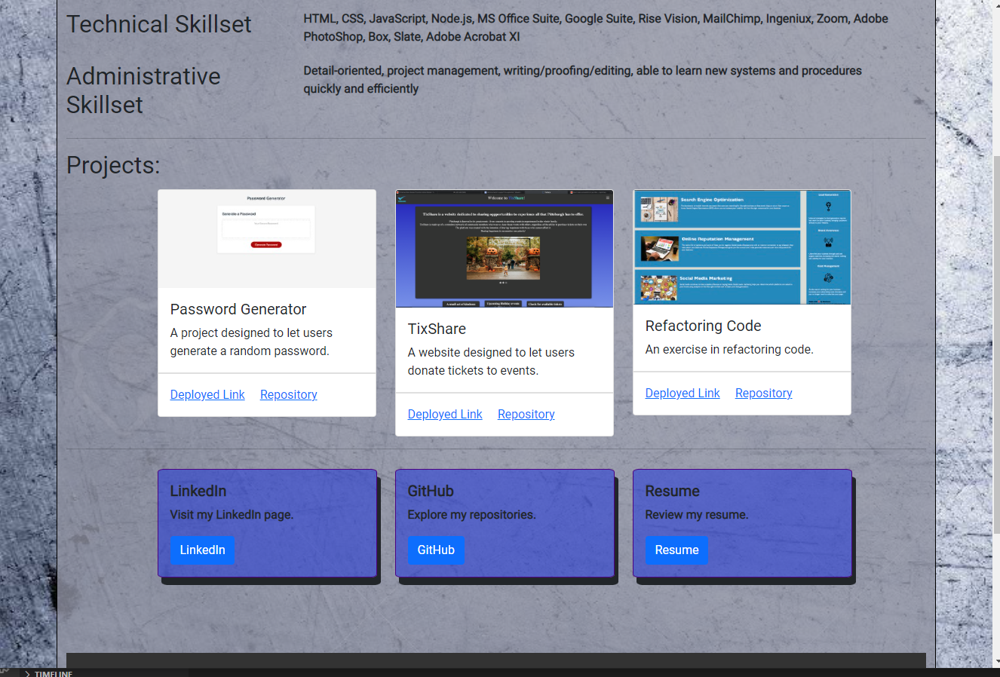

Tracy Torisky Professional Portfolio

ttorisky@gmail.com

Potential employers will be able to view my portfolio and examine my background, skills, and experience.  They will also have access to my contact information.

 My full name, address and e-mail at the top of the page.

The "About Me" section will explain to the user where I am as a developer and speak to my career goals.  

The "About Me" section also gives an overview of my present skillsets including technologies and administrative skills.

The "Technical Skillset" area details specifically what technologies I have experience in.

The "Administrative Skillset" area details the valuable administrative experience and skills I have developed through out my career.

The "Projects" area show screenshots of three projects along with a brief description of the project objectives and includes links to the deployed projects and repositories.

The bottom area has three separate buttons that include an invitation to the user to click on them to view my GitHub and LinkedIn pages as well as a pdf of my resume.

This professional portfolio highlights my new skills in Development and outlines my talent stack as a whole.

